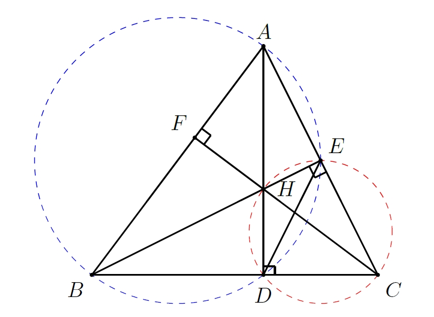

# 梦开始的地方
多年前思考过教科书上没有的几何题：从三角形两顶点做垂线交于一点，证明另一个顶点和交点连线会垂直另一边。那时我是通过共圆的技巧证明的，觉得挺巧妙。给我初中同学做没做出来，看起来很简单，其实非常巧妙。不久前看了谷歌Deepmind发布的AlphaGeometry，用AI来证明几何奥数题，巧合地发现他们文章中提供的例子和我那时想的题竟然重合。连展示的AlphaGeometry回溯法思路也是用的共圆，似曾相识。下面给出这个几何问题的共圆证明。
<!-- 改变图大小 -->

  

> 如上图所示，在 $\triangle ABC$ 中，$AD,BE$ 分别是 $BC,CA$ 边上的垂线，且两条垂线 $AD,BE$ 相交于点 $H$。证明：$CH\perp AB$。
> > 证明：  设 $CH$ 延长线交 $AB$ 于点 $F$。连接 $DE$。由于 $\angle AEB =\angle ADB =\frac{\pi}{2}$，因此点 $E,A,B,D$ 共圆，故 $\angle ABE =\angle ADE$。同理 $H,E,C,D$ 共圆，故 $\angle EHC = \angle EDC$。在 $\triangle FBH$ 中，我们可以得到：
$$
\begin{aligned}
    \angle FBH +\angle FHB & = \angle ABE +\angle EHC \\
    & = \angle ADE +\angle EDC \\
    & = \angle ADC =\frac{\pi}{2} \\
\end{aligned}   
$$
因此 $CH\perp AB$。