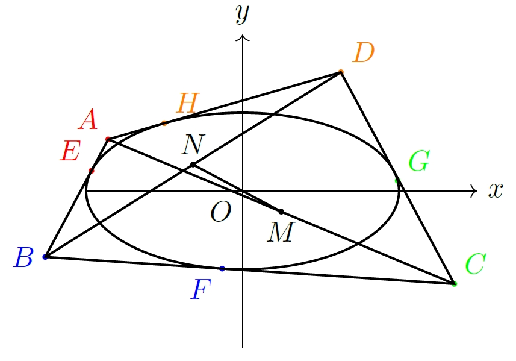

# 椭圆外切四边形共线问题

> 试证：椭圆的外切四边形的对角线的中点连线必过椭圆的中心。
<!-- > waiqie_sibianxing -->

  

**证明**
设椭圆方程为 $b^2x^2+a^2y^2 = a^2b^2$，设切点 $E,F,G,H$ 分别为 $(a\cos\alpha_i,b\sin \alpha_i), i=1,2,3,4$，点 $M,N$ 分别是 $AC, BD$ 中点。可以得到 $E,H$  处切线方程为

$$
\begin{equation}
    \begin{cases}
       & b\cos \alpha _1 x +a\sin \alpha _1 y = ab,\\
       & b\cos \alpha _4 x +a\sin \alpha _4 y = ab.
    \end{cases}
\end{equation}
$$

因此，求得 $A$ 点横坐标

$$
\begin{aligned}
    x_A & = \frac{a(\sin \alpha_4-\sin \alpha_1)}{\sin(\alpha_4-\alpha_1)} \\
        & = \frac{2a\cos\frac{\alpha _4+\alpha_1}{2}\sin\frac{\alpha_4-\alpha_1}{2}}{2\sin \frac{\alpha _4-\alpha _1}{2}\cos\frac{\alpha_4-\alpha_1}{2}} \\
        & = \frac{a\cos\frac{\alpha _4+\alpha _1}{2}}{\cos\frac{\alpha_4-\alpha_1}{2}}.
\end{aligned}
$$

同理求得 $A$ 纵坐标 $y_A =\frac{b\sin\frac{\alpha _4+\alpha _1}{2}}{\cos\frac{\alpha_4-\alpha_1}{2}}$，即 $A(\frac{a\cos\frac{\alpha _4+\alpha _1}{2}}{\cos\frac{\alpha_4-\alpha_1}{2}},\frac{b\sin\frac{\alpha _4+\alpha _1}{2}}{\cos\frac{\alpha_4-\alpha_1}{2}})$，其余三个点坐标依次求得 

$$
\begin{aligned}
   & B(\frac{a\cos\frac{\alpha _2+\alpha _1}{2}}{\cos\frac{\alpha_2-\alpha_1}{2}},\frac{b\sin\frac{\alpha _2+\alpha _1}{2}}{\cos\frac{\alpha_2-\alpha_1}{2}}), \\
   & C(\frac{a\cos\frac{\alpha _3+\alpha _2}{2}}{\cos\frac{\alpha_3-\alpha_2}{2}},\frac{b\sin\frac{\alpha _3+\alpha _2}{2}}{\cos\frac{\alpha_3-\alpha_2}{2}}), \\
   & D(\frac{a\cos\frac{\alpha _4+\alpha _3}{2}}{\cos\frac{\alpha_4-\alpha_3}{2}},\frac{b\sin\frac{\alpha _4+\alpha _3}{2}}{\cos\frac{\alpha_4-\alpha_3}{2}}).
\end{aligned}
$$

因此直线 $OM$ 的斜率为

$$
\begin{aligned}
    k_{OM} & = \frac{y_A+y_C}{x_A+x_C} \\
            & = \frac{\frac{b\sin\frac{\alpha _4+\alpha _1}{2}}{\cos\frac{\alpha_4-\alpha_1}{2}}+\frac{b\sin\frac{\alpha _3+\alpha _2}{2}}{\cos\frac{\alpha_3-\alpha_2}{2}}}{\frac{a\cos\frac{\alpha _4+\alpha _1}{2}}{\cos\frac{\alpha_4-\alpha_1}{2}}+\frac{a\cos\frac{\alpha _3+\alpha _2}{2}}{\cos\frac{\alpha_3-\alpha_2}{2}}} \\
            & = \frac{b}{a} \frac{\sin\frac{\alpha _3+\alpha _2}{2}\cos \frac{\alpha _4-\alpha _1}{2}+\sin\frac{\alpha _1+\alpha _4}{2}\cos\frac{\alpha _3-\alpha _2}{2}}{\cos\frac{\alpha _3+\alpha _2}{2}\cos\frac{\alpha _4-\alpha _1}{2}+\cos \frac{\alpha _1+\alpha _4}{2}\cos\frac{\alpha_3-\alpha _2}{2}} \\
            & = \frac{b}{a} \frac{\sum_{i=1}^4\sin\left(\frac{\alpha }{2}-\alpha _i\right)}{\sum_{i=1}^4\cos\left(\frac{\alpha }{2}-\alpha _i\right)}, 
\end{aligned}
$$

其中 $\alpha = \alpha _1+\alpha _2+\alpha _3+\alpha _4$。

同理

$$
\begin{equation}
    k_{ON} = \frac{y_B+y_D}{x_B+x_D} = \frac{b}{a} \frac{\sum_{i=1}^4\sin\left(\frac{\alpha }{2}-\alpha _i\right)}{\sum_{i=1}^4\cos\left(\frac{\alpha }{2}-\alpha _i\right)}.
\end{equation}
$$

因此 $k_{OM} =k_{ON}$，即 $O,M,N$ 共线。
