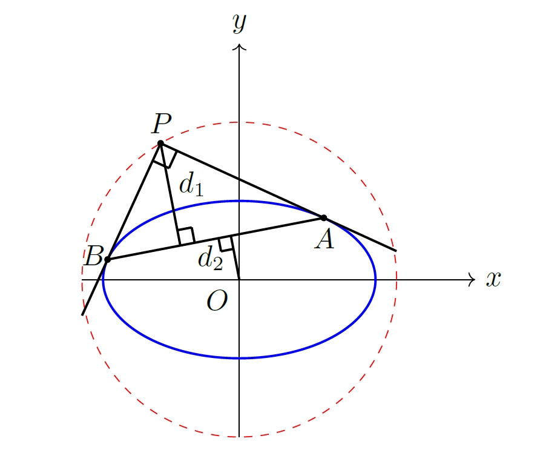

# 椭圆距离乘积定值

## 三种证法
> 设椭圆的两切线互相垂直，则从中心到切点弦的距离，与二切线交点到切点弦的距离之积为常数。

<div style="display: flex; justify-content: center;">
  
</div>

证法一：设 $P(x_0,y_0)$ 为交点，两切点分别为 $A(x_1,y_1),B(x_2,y_2)$，则得到切线 $PA$ 方程为 $\frac{x_1x}{a^2}+\frac{y_1y}{b^2}=1$，同理另一条切线 $PB$ 方程为 $\frac{x_2x}{a^2}+\frac{y_2y}{b^2}=1$。两切线互相垂直，则法线互相垂直，即
$$
        \label{eq:perpendicular}
        \frac{x_1x_2}{a^4}+\frac{y_1y_2}{b^4}=0.
$$
上式两边平方得到 $\frac{x_1^2x_2^2}{a^8}+\frac{y_1^2y_2^2}{b^8}=0$，而
$$ \begin{align*}
        \frac{x_1^2x_2^2}{a^8} & =\frac{1}{a^4}\cdot \frac{x_1^2}{a^2}\frac{x_2^2}{a^2} \\
        & =\frac{1}{a^4}(1-\frac{y_1^2}{b^2}) (1-\frac{y_2^2}{b^2}) \\
        & =\frac{1}{a^4}\left(1-\frac{y_1^2+y_2^2}{b^2}+\frac{y_1^2y_2^2}{b^4}\right).
    \end{align*}$$
而 $x_1x_2y_1y_2 =-\frac{a^4}{b^4}y_1^2y_2^2$，因此可以得到关于 $y_1^2+y_2^2$ 和 $y_1^2y_2^2$的核心关系式：
$$
\label{eq:relationship y1^2+y2^2 y1^2y2^2}
y_1^2+y_2^2 =b^2-\frac{(a^2+b^2)c^2y_1^2y_2^2}{b^6}.
$$
由于两切线都经过 $P(x_0,y_0)$，因此
$$
\label{eq:point on two tangents}
\begin{cases}
\frac{x_1x_0}{a^2}+\frac{y_1y_0}{b^2}=1,\\
\frac{x_2x_0}{a^2}+\frac{y_2y_0}{b^2}=1.
\end{cases}
$$
故直线 $\frac{x_0x}{a^2}+\frac{y_0y}{b^2}=1$ 经过 $A,B$ 两点，即该直线也是切点弦 $AB$。设 $d_1$ 为点 $P$ 到切点弦 $AB$ 的距离，$d_2$ 为原点到切点弦 $AB$ 的距离，故

$$
d_1 = \frac{\bigl|\tfrac{x_0^2}{a^2}+\tfrac{y_0^2}{b^2}-1\bigr|}{\sqrt{\tfrac{x_0^2}{a^4}+\tfrac{y_0^2}{b^4}}},\quad
d_2 = \frac{1}{\sqrt{\tfrac{x_0^2}{a^4}+\tfrac{y_0^2}{b^4}}}.
$$

因此

$$
\label{eq:product of distances}
d_1 d_2
=\frac{\bigl|\tfrac{x_0^2}{a^2}+\tfrac{y_0^2}{b^2}-1\bigr|}{\tfrac{x_0^2}{a^4}+\tfrac{y_0^2}{b^4}}.
$$

由于 $OA,OB$ 不平行，因此 $x_2y_1-x_1y_2\neq0$。由~\eqref{eq:point on two tangents} 解得：

$$
\begin{cases}
x_0 = \frac{a^2(y_2-y_1)}{y_2x_1-y_1x_2},\\
y_0 = \frac{b^2(x_2-x_1)}{x_2y_1-x_1y_2}.
\end{cases}
$$

带入到~\eqref{eq:product of distances}，并结合~\eqref{eq:perpendicular} 以及椭圆方程 $\frac{x_i^2}{a^2}+\frac{y_i^2}{b^2}=1\;(i=1,2)$，可以计算分子

$$
\begin{aligned}
        \frac{x_0^2}{a^2}+\frac{y_0^2}{b^2}-1 & =\frac{a^2(y_2-y_1)^2}{(y_2x_1-y_1x_2)^2}+\frac{b^2(x_2-x_1)^2}{(x_2y_1-x_1y_2)^2}-1 \\
        & =\frac{a^2(y_2^2-2y_1y_2+y_2^2)+b^2(x_2^2-2x_1x_2+x_2^2)}{(y_2x_1-y_1x_2)^2}-1\\
        & =\frac{(a^2y_2^2+b^2x_2^2) +(a^2y_1^2+b^2x_1^2)-2a^2y_1y_2-2b^2x_1x_2-(y_2x_1-y_1x_2)^2}{(y_2x_1-y_1x_2)^2} \\
        & = \frac{2a^2b^2-(2a^2y_1y_2+2b^2x_1x_2)-(y_2x_1-y_1x_2)^2}{(y_2x_1-y_1x_2)^2} \\
        & =\frac{2a^2b^2-(2a^2y_1y_2-\frac{2a^4}{b^2}y_1y_2)-(x_1^2y_2^2-2x_1x_2y_1y_2+y_1^2x_2^2)}{(y_2x_1-y_1x_2)^2} \\
        & = \frac{2a^2b^2+\frac{2a^2c^2}{b^2}y_1y_2-\left(a^2(1-\frac{y_1^2}{b^2})y_2^2+\frac{2a^4}{b^4}y_1^2y_2^2+y_1^2\cdot a^2(1-\frac{y_2^2}{b^2})\right)}{(y_2x_1-y_1x_2)^2}\\ 
        & = \frac{2a^2b^2+\frac{2a^2c^2}{b^2}y_1y_2-\frac{2a^2c^2}{b^4}y_1^2y_2^2-a^2(y_1^2+y_2^2)}{(y_2x_1-y_1x_2)^2}\\
\end{aligned}
$$

结合~\eqref{eq:relationship y1^2+y2^2 y1^2y2^2}，可得

$$
2a^2b^2+\frac{2a^2c^2}{b^2}y_1y_2-\frac{2a^2c^2}{b^4}y_1^2y_2^2 - a^2(y_1^2+y_2^2)
= a^2b^2\Bigl(1+\frac{c^2}{b^4}y_1y_2\Bigr)^2.
$$

因此分子为
$$
\label{eq:product of distances numerator}
    \Bigl|\tfrac{x_0^2}{a^2}+\tfrac{y_0^2}{b^2}-1\Bigr|
    =\frac{a^2b^2\Bigl(1+\frac{c^2}{b^4}y_1y_2\Bigr)^2}{(y_2x_1-y_1x_2)^2}.
$$

还可通过另一种方式计算 $y_2^2x_1^2-2x_1x_2y_1y_2+y_1^2x_2^2$：

$$
\begin{aligned}
        y_2^2x_1^2-2x_1x_2y_1y_2+y_1^2x_2^2 & = a^2(1-\frac{y_2^2}{b^2})y_2^2+b^2(1-\frac{x_1^2}{a^2})x_2^2+\frac{2a^4}{b^4}y_1^2y_2^2 \\
        & =(a^2y_2^2+b^2x_2^2)-\frac{a^2}{b^2}y_1^2y_2^2-\frac{b^2}{a^2}x_1^2x_2^2+\frac{2a^4}{b^4}y_1^2y_2^2 \\
        & =a^2b^2-\frac{a^2}{b^2}y_1^2y_2^2-\frac{a^6}{b^6}y_1^2y_2^2+\frac{2a^4}{b^4}y_1^2y_2^2 \\
        & = a^2b^2-\frac{a^2c^4}{b^6}y_1^2y_2^2.
\end{aligned}
$$

因此

$$
    \begin{align*}
        2a^2b^2+\frac{2a^2c^2}{b^2}y_1y_2-\frac{2a^2c^2}{b^4}y_1^2y_2^2-a^2(y_1^2+y_2^2)  & = a^2b^2 + \frac{2a^2c^2}{b^2}y_1y_2+\frac{a^2c^4}{b^6}y_1^2y_2^2\\
        & =\frac{a^2(b^4+c^2y_1y_2)^2}{b^6} \\
        & = a^2b^2\left(1+\frac{c^2}{b^4}y_1y_2\right)^2.
    \end{align*}
$$

对于分母，

$$
    \begin{align*}
        \frac{x_0^2}{a^4}+\frac{y_0^2}{b^4} & =\frac{(y_2-y_1)^2+(x_2-x-1)^2}{(y_2x_1-y_1x_2)^2} \\
        & =\frac{(y_2^2-2y_1y_2+y_1^2)+(x_2^2-2x_1x_2+x_1^2)}{(y_2x_1-y_1x_2)^2}.
    \end{align*}
$$
又
$$    \begin{align*}
        (y_2^2-2y_1y_2+y_1^2)+(x_2^2-2x_1x_2+x_1^2) & = y_1^2+y_2^2-2y_1y_2+a^2(1-\frac{y_1^2}{b^2})+a^2(1-\frac{y_2^2}{b^2})+\frac{2a^4}{b^4}y_1y_2 \\
        & = 2a^2-\frac{c^2}{b^2}(y_1^2+y_2^2)+\frac{2c^2(a^2+b^2)}{b^4}y_1y_2 \\
        & = 2a^2-c^2+\frac{(a^2+b^2)c^4}{b^8}y_1^2y_2^2+\frac{2c^2(a^2+b^2)}{b^4}y_1y_2 \\
        & =(a^2+b^2)\left(1+\frac{c^2}{b^4}y_1y_2\right)^2.
    \end{align*}
$$
因此分母为 
$$
        \label{eq:product of distances denominator}
        \frac{x_0^2}{a^4}+\frac{y_0^2}{b^4} = \frac{(a^2+b^2)\left(1+\frac{c^2}{b^4}y_1y_2\right)^2}{(y_2x_1-y_1x_2)^2}.
$$
结合~\eqref{eq:product of distances numerator} 和~\eqref{eq:product of distances denominator}，可得

$$
d_1 d_2 = \frac{a^2b^2}{a^2+b^2}.
$$

## AI 画图
先贴出所用到的tikz代码

```js
\begin{tikzpicture}[scale=1]
        % 坐标轴

        \draw[->] (-2,0) -- (3,0) node[right] {$x$};
        \draw[->] (0,-2) -- (0,3) node[above] {$y$};
        %标记原点
        \node at (0,0) [below left] {$O$};
        % 绘制椭圆：x^2/3 + y^2 = 1, a = sqrt(3), b = 1.
        \draw[blue, thick] (0,0) ellipse ({sqrt(3)} and 1);
        % 绘制圆：x^2+y^2 = 4, 半径 = 2.
        \draw[red, dashed] (0,0) circle (2);

        % 标记外部点 P=(-1, sqrt(3))
        \coordinate (P) at (-1, {sqrt(3)});
        \filldraw[black] (P) circle (1pt) node[above] {$P$};
        % 定义切点 T1 和 T2（解析解）
        \coordinate (A) at ({(-3+3*sqrt(21))/10}, {(9+sqrt(21))/(10*sqrt(3))});
        \coordinate (B) at ({(-3-3*sqrt(21))/10}, {(9 - sqrt(21))/(10*sqrt(3))});
        \coordinate (O) at (0,0);
        
        \coordinate (P1) at ($(P)!0.15!(B)$);
        \coordinate (P2) at ($(P)!0.1!(A)$);
        \coordinate (P3) at ($(P)!0.15!(B)+(P)!0.1!(A)-(P)$);
        %连接P3P1, P3P2
        \draw[thick] (P3) -- (P1);
        \draw[thick] (P3) -- (P2);
        % 求出 O 在AB上的垂足
        % 计算 O 在 AB 上的垂足
        % 定义点 A, B, P 的坐标
        \pgfmathsetmacro{\xA}{(-3+3*sqrt(21))/10}
        \pgfmathsetmacro{\yA}{(9+sqrt(21))/(10*sqrt(3))}
        \pgfmathsetmacro{\xB}{(-3-3*sqrt(21))/10}
        \pgfmathsetmacro{\yB}{(9-sqrt(21))/(10*sqrt(3))}
        \pgfmathsetmacro{\xP}{-1}
        \pgfmathsetmacro{\yP}{sqrt(3)}
        \pgfmathsetmacro{\t}{-(\xA*(\xB-\xA)+\yA*(\yB-\yA))/((\xB-\xA)^2+(\yB-\yA)^2)}
        \coordinate (F) at ({\xA+\t*(\xB-\xA)}, {\yA+\t*(\yB-\yA)});
        % 标记 F
        % \filldraw[black] (F) circle (1pt) node[below left] {$F$};
        % 计算 P点 在 AB 上的垂足
        \pgfmathsetmacro{\tP}{-((\xA-\xP)*(\xB-\xA)+(\yA-\yP)*(\yB-\yA))/((\xB-\xA)^2+(\yB-\yA)^2)}
        \coordinate (FP) at ({\xA+\tP*(\xB-\xA)}, {\yA+\tP*(\yB-\yA)});
        % \filldraw[black] (F_P) circle (1pt) node[below right] {$F_P$};
        %连接PF,OF_P
        \draw[thick] (P) -- (FP);
        \draw[thick] (O) -- (F);
        %%FP处垂足
        \coordinate(FP1) at ($(FP)!0.15!(P)$);
        \coordinate(FP2) at ($(FP)!0.1!(A)$);
        \coordinate(FP3) at ($(FP)!0.15!(P)+(FP)!0.1!(A)-(FP)$);
        %连接FP3FP1, FP3FP2
        \draw[thick] (FP3) -- (FP1);
        \draw[thick] (FP3) -- (FP2);%
        %% F 处垂足
        \coordinate(F1) at ($(F)!0.3!(O)$);
        \coordinate(F2) at ($(F)!0.1!(B)$);
        \coordinate(F3) at ($(F)!0.3!(O)+(F)!0.1!(B)-(F)$);
        %连接F3F1, F3F2
        \draw[thick] (F3) -- (F1);
        \draw[thick] (F3) -- (F2);
        %标记OF中点
        \coordinate (M) at ($(O)!0.5!(F)$);
        \node [left] at (M) {$d_2$};
        %标记PFP中点
        \coordinate (MP) at ($(P)!0.4!(FP)$);
        \node [right] at (MP) {$d_1$};
        % 定义切线斜率和截距（精确表达）
        \pgfmathsetmacro{\mOne}{(sqrt(3)+sqrt(7))/2}
        \pgfmathsetmacro{\mTwo}{(sqrt(3)-sqrt(7))/2}
        \pgfmathsetmacro{\cOne}{sqrt(3)+\mOne} % = (3*sqrt(3)+sqrt(7))/2
        \pgfmathsetmacro{\cTwo}{sqrt(3)+\mTwo} % = (3*sqrt(3)-sqrt(7))/2

        % 绘制切线 1: y = m1*x + c1
        \draw[thick] plot[domain=-2:-1, samples=100] (\x, {\mOne*\x+\cOne});

        % 绘制切线 2: y = m2*x + c2
        \draw[thick] plot[domain=-1:2, samples=100] (\x, {\mTwo*\x+\cTwo});
        % 标记切点
% 标记切点
        \filldraw[black] (A) circle (1pt) node[below] {$A$};
        \filldraw[black] (B) circle (1pt) node[left] at ({(-3-3*sqrt(21))/10+0.1}, {(9 - sqrt(21))/(10*sqrt(3))+0.05}) {$B$};
        % 连接 AB
        \draw[thick] (A) -- (B);
    \end{tikzpicture}
```
并没有系统学过 tikz 代码，全程使用 AI+Copilot 提示完成，并通过人工微调，现在大模型的出现使得学习门槛进一步降低。tikz有个舒服的地方就是编程思维，画图等于全程写代码。画垂足稍微思考了一下，AI 能提供一些基础语法，通过向量运算很容易解决。其它画椭圆、直线、标记点、连线全都是 AI 补全或者提示，非常方便。

## 存在问题
1. 微软自带的 Copilot 不是免费的，有次数限制，羊毛不能一直薅。之前学生认证使用 Pro 给我取消了。
2. 纯 tikz 代码如何用 md 渲染，目前用的截图的方式。


